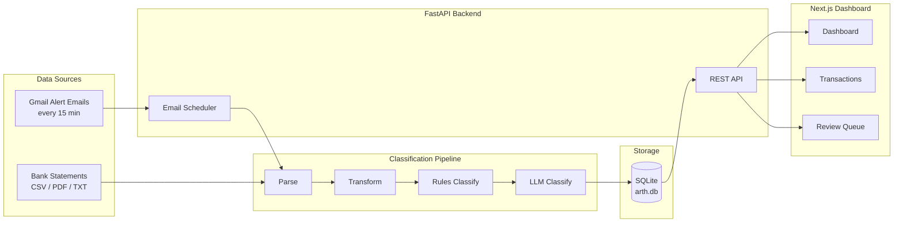

# Arth

Personal finance system for Sashank and Aditi — built for India's banking ecosystem. Ingests raw bank statements and live Gmail alert emails, classifies every transaction using deterministic rules and LLM, stores everything in a local SQLite database, and surfaces insights on a Next.js dashboard.

**Not a startup. Not a SaaS product. A tool built by two people, for two people.**

---

## What It Does Today

| Capability | Details |
|---|---|
| **Transaction ingestion** | Parse statements from 4 bank sources: HDFC savings, HDFC CC (×2), ICICI savings |
| **Auto-classification** | Rules + LLM pipeline assigns type, channel, counterparty, and category to every transaction |
| **Real-time email scraping** | Gmail API polls bank alert emails every 15 minutes — no waiting for monthly statements |
| **Statement reconciliation** | Email and statement data are automatically merged; no duplicates, no lost review work |
| **Dashboard** | Session login, spending overview (charts + drill-downs), transactions, review queue, goals, settings (reminders + statement upload) |
| **3,236 transactions** | Across all 4 sources, all-time — fully classified and searchable |

---

## Quick Start

```bash
# 1. Install dependencies
python3 -m pip install -r requirements.txt

# 2. Configure API keys and settings
cp .env.example .env
# Edit .env: LLM API keys (Google, Anthropic, or OpenAI) plus AUTH_* for dashboard login

# 3. Load your bank statements into the database
python3 -m pipeline.run --all-sources

# 4. Start the API server
python3 -m uvicorn api.main:app --port 8000 --reload
# Swagger UI → http://localhost:8000/docs

# 5. Start the dashboard
cd dashboard && npm install && npm run dev
# Dashboard → http://localhost:3000
```

For Gmail email scraper setup, see [`scraper/README.md`](scraper/README.md).

---

## System Architecture



---

## Dashboard

Next.js app with cookie-based login (`/login` → FastAPI sets `arth_session`). Main areas:

| Screen | What it shows |
|---|---|
| **Dashboard** (`/`) | This-month snapshot, trend charts, category grids, bar drill-down, goals/reminders, upload entry points |
| **Transactions** (`/transactions`) | Searchable, filterable, sortable table with server-side pagination; slide-in edit (counterparty, category, txn type, spend tags, exclude-from-analytics) |
| **Review Queue** (`/review`) | Card-based view of unreviewed transactions (mainly email-sourced); approve, edit-and-approve, or skip |
| **Goals** (`/goals`) | Financial goals with progress tied to metrics/charts |
| **Settings** (`/settings`) | Payment reminders and statement upload |

See [`dashboard/README.md`](dashboard/README.md) for setup and implementation details.

---

## How the Pipeline Works

Five stages, all bank-agnostic after Stage 1:

```
[1] Parse          → source-specific parser extracts raw rows
[2] Transform      → normalize to canonical schema (IDs, ISO dates, direction, amount)
[3] Rules Classify → deterministic rules fill channel, txn_type, upi_type (~96–100% accuracy)
[4] LLM Classify   → fills counterparty, category, and remaining ambiguous fields
[5] Write SQLite   → content-hash dedup; backfills NULLs without overwriting manual edits
```

**Adding a new bank source = write one parser file.** Everything downstream is bank-agnostic.

Classification accuracy on the full dataset (March 2026):

| Field | Accuracy |
|---|---|
| direction / amount / channel | 100% |
| txn_type | 98.7% |
| upi_type | 98.1% |
| counterparty | 94.9% |
| counterparty_category | 93.7% |

See [`pipeline/README.md`](pipeline/README.md) for architecture details, CLI reference, and how to add new bank sources.

---

## Real-Time Email Scraper

The server polls Gmail for bank alert emails every 15 minutes, covering ~70–80% of day-to-day spending in real time. When a monthly statement is uploaded, email-sourced transactions are automatically reconciled — no duplicates, no lost review work.

| Bank / Account | What email captures | What needs a statement |
|---|---|---|
| HDFC CC (1905/5778) | All CC swipes (real-time) | Refunds, cashback, auto-pay |
| HDFC Savings 3703 | UPI outbound + inbound | Net banking transfers, salary |
| ICICI Savings 6118 | IMPS + NEFT via iMobile | All inbound, ICICI Direct trades |

See [`scraper/README.md`](scraper/README.md) for setup (GCP project, OAuth consent, first-run flow).

---

## API Reference

The FastAPI backend groups routes like this (all except `/api/auth/*` login/logout and `/health` require a valid session cookie after login):

| Group | Prefix | What it does |
|---|---|---|
| Auth | `/api/auth` | Login, logout, session status |
| Transactions | `/api/transactions` | List, filter, CRUD, bulk update |
| Metrics | `/api/metrics` | Summary, categories, trends, accounts, dashboard chart series |
| Pipeline | `/api/pipeline` | Trigger runs, upload statements, run history |
| Scraper | `/api/scraper` | Scheduler control, OAuth, coverage map |
| Recurring | `/api/recurring` | Detect and manage recurring patterns |
| Goals | `/api/goals` | CRUD for user goals |
| Settings | `/api/settings` | Reminders |

Full interactive docs at **http://localhost:8000/docs** (Swagger UI).

See [`api/README.md`](api/README.md) for the complete endpoint reference and database schema.

---

## Project Structure

```
Arth/
  pipeline/                  Classification pipeline (Parse → Transform → Rules → LLM → Write)
    parsers/                   Bank-specific statement parsers (HDFC savings/CC, ICICI)
    config.py                  All knobs in one place (models, paths, source configs, LLM chain)
    models.py                  Pydantic models and classification enums
    rules_classifier.py        Deterministic classification rules
    llm_classifier.py          LLM abstraction (multi-model fallback, caching, tokens)
    db_writer.py               SQLite writer: content-hash dedup + email reconciliation
    run.py                     CLI entry point

  api/                       FastAPI backend
    main.py                    App entry point, CORS, lifespan, scheduler start/stop
    database.py                Engine, session factory, init_db()
    models.py                  SQLModel table definitions (Transaction, PipelineRun, ProcessedEmail)
    routes/
      transactions.py          Transaction CRUD, filtering, bulk update
      metrics.py               5 metrics endpoints (summary, category, trend, counterparties, accounts)
      pipeline.py              Trigger runs, list runs, run status
      scraper.py               Scraper control + OAuth endpoints

  scraper/                   Gmail email scraper
    email_parsers/             Bank-specific email parsers (HDFC CC, HDFC savings, ICICI)
    orchestrator.py            Main scrape cycle (fetch → dedup → parse → classify → write)
    scheduler.py               APScheduler wrapper (runs inside the FastAPI process)
    gmail_client.py            OAuth2 auth + email fetching

  dashboard/                 Next.js frontend
    src/app/                   Pages: /, /login, /transactions, /review, /goals, /settings
    src/components/            Dashboard V2, layout, transactions, review, goals, settings
    src/hooks/                 React Query hooks (use-transactions, use-metrics)
    src/lib/                   Types, API client, utilities

  prompts/                   YAML prompt templates (git-versioned, safe to commit)
  scripts/                   One-time setup and migration scripts
  tests/                     pytest test suite (86+ tests)
  docs/                      Architecture docs, evaluations, PRD, data notes
  data/                      SQLite database, LLM cache (all gitignored)
```

---

## Development

**Run tests:**
```bash
pytest tests/
```

CI (GitHub Actions) runs `ruff`, `mypy`, and `pytest` with coverage on `pipeline/` and `api/` and fails if combined coverage drops below **35%** (see `.github/workflows/ci.yml`). Scraper code is not part of that gate yet.

**Optional — match CI lint locally before you push:**
```bash
python3 -m pip install pre-commit
pre-commit install
```
Hooks run `ruff check` on `pipeline/`, `api/`, `scraper/`, and `tests/` (same paths as CI).

**Environments:**

| Environment | DB file | Start command |
|---|---|---|
| prod | `data/arth.db` | `python3 -m uvicorn api.main:app --port 8000` |
| test | `data/arth_test.db` | `APP_ENV=test python3 -m uvicorn api.main:app --port 8001` |
| pytest | in-memory SQLite | `pytest tests/` |

**Local file permissions (Phase A.5):** After `init_db()` creates or touches the SQLite file, Arth sets **`chmod 600`** on `data/arth.db` (and `data/gmail_token.json` when present) so only your OS user can read/write them. This is a best-effort call on Unix-like systems; use full-disk encryption for stronger at-rest protection. See [`docs/evaluations/sqlcipher-evaluation.md`](docs/evaluations/sqlcipher-evaluation.md) for full-database encryption (SQLCipher) — **deferred** for this project’s threat model.

**Add a new bank parser:** See [`pipeline/README.md`](pipeline/README.md) for a step-by-step guide.

**Modify LLM prompts:** Edit the YAML files in `prompts/`. Read [`prompts/README.md`](prompts/README.md) first.

---

## Current Status

Phases 0–4 complete. Phase 5 (Agentic Q&A system) is next.

| Phase | What was built | Status |
|---|---|---|
| Phase 0 | Foundation: prompts to YAML, git setup, worktrees | ✅ Done |
| Phase 1 | Parsers: HDFC CC, ICICI savings, LLM benchmark + accuracy | ✅ Done (Mar 14) |
| Phase 2 | Storage: SQLite database, FastAPI backend | ✅ Done (Mar 15) |
| Phase 3 | UI: Next.js dashboard, 3 screens, metrics API | ✅ Done (Mar 19) |
| Phase 4 | Email scraper: Gmail API, reconciliation, 86 tests | ✅ Done (Mar 19) |
| Phase 5 | Agentic Q&A: RAG agent, researcher, evals, memory | Pending |


---

## Key Design Decisions

| Decision | Choice | Why |
|---|---|---|
| Database | SQLite (not Postgres) | 2 users, single machine, zero ops overhead |
| Classification | Rules first, LLM second | Deterministic rules hit 96–100% accuracy; LLM handles only the long tail |
| LLM primary | gemini-3.1-flash-lite | 81% accuracy at $0.0025/20 txns — best quality-to-cost (Mar 2026 benchmark) |
| Prompt storage | YAML files | Structured, git-versioned, safe to commit |
| Backend | FastAPI (Python) | Stays in the pipeline's language; auto-generates Swagger docs |
| Frontend | Next.js + shadcn/ui | Portfolio-grade UI, strong TypeScript ecosystem |
| Email ingestion | APScheduler inside FastAPI | One process to manage; no Celery overhead for a personal tool |
| Parallel dev | Git worktrees | Multiple Cursor windows on independent branches |
