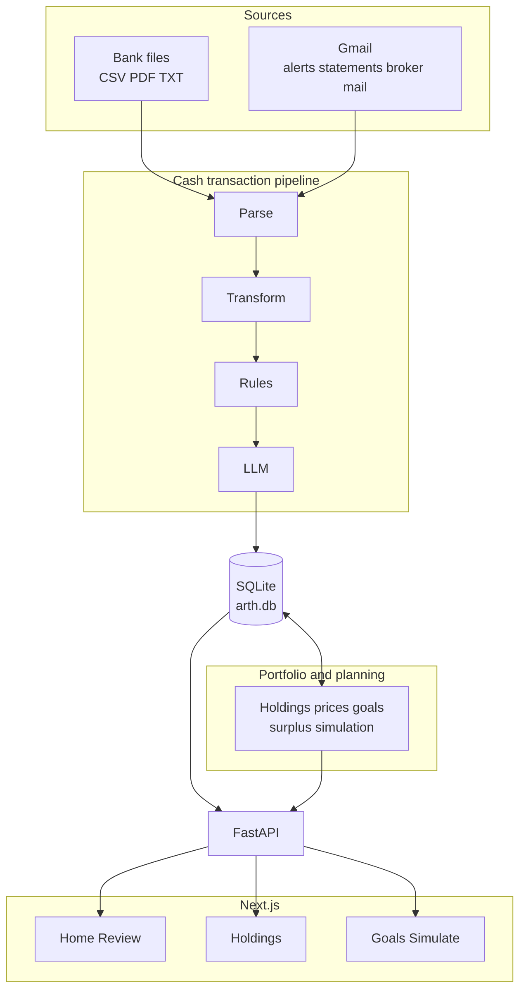

# Arth

**Arth is a personal finance app that actually understands how money works in India.** Import bank statements, track spending, set goals, and see your full picture — holdings, cash flow, and what-if planning — in one self-hosted place. Built for real households, not spreadsheet wizards.

If you want screenshots here, add them after your first open-source release (e.g. `docs/images/home.png`).

---

## For developers

Everything below is for people cloning the repo, running it locally, or contributing.

### What it does (technical)

One **SQLite** database, a **FastAPI** backend, and a **Next.js** dashboard: transaction import and sorting, **holdings** (net worth, marks, liabilities), **goals** (hierarchy, priorities, life events), and **Simulate** (surplus and goal funding). Gmail and file uploads feed the same ledger; built-in rules plus smart auto-labels sort spend; jobs refresh prices and inflation data.


| Capability                  | Details                                                                                                                                              |
| --------------------------- | ---------------------------------------------------------------------------------------------------------------------------------------------------- |
| **Holdings**                | Positions across sleeves (equity, MF, PPF, NPS, …), net worth and history, price / NAV marks (NSE bhav, AMFI, fallbacks), liabilities — `/portfolio` |
| **Simulate**                | Surplus, liquidity, inflation-aware goal funding and what-if runs — `/simulate` and `/goals` with `/api/simulate`, surplus, liquidity APIs           |
| **Goals**                   | Goal graph (links, hierarchy), priorities, life events, reminders                                                                                    |
| **Cash ledger & analytics** | Full transaction table, metrics, trends, recurring detection, **Review** for new lines                                                               |
| **Transaction ingestion**   | Parsers for common Indian bank exports (HDFC savings & credit card, ICICI savings — extend via `pipeline/parsers/`)                                  |
| **Auto-sorting**            | Rules plus model-assisted labels for channel, counterparty, and category                                                                             |
| **Gmail**                   | Optional scheduled read of bank alert mail (see `[scraper/README.md](scraper/README.md)`)                                                            |
| **Matching**                | Email-sourced and statement-sourced rows merged without duplicates or losing your edits                                                              |
| **Dashboard**               | Session login, then Home, transactions, Review, holdings, goals, Simulate, Settings                                                                  |


### Quick start

```bash
# 1. Install dependencies
python3 -m pip install -r requirements.txt

# 2. Configure API keys and settings
cp .env.example .env
# Edit .env: AUTH_* for dashboard login; LLM keys — use *_FOR_CLASSIFIER (import path) and
# *_FOR_SINGLE_AGENT (CLI agent) so provider usage is split; see .env.example

# 3. Load your bank statements into the database
python3 -m pipeline.run --all-sources

# 4. Start the API server (omit access logs for a quieter terminal)
python3 -m uvicorn api.main:app --port 8000 --reload --no-access-log
# API docs → http://localhost:8000/docs

# 5. Start the dashboard
cd dashboard && npm install && npm run dev
# App → http://localhost:3000
```

**Logs:** shared logging for API, scraper, and jobs — see [Logs and terminals](api/README.md#logs-and-terminals) in `api/README.md`. Detail file: `data/logs/arth.log` (`*.log` is gitignored).

**Gmail:** `[scraper/README.md](scraper/README.md)`. **Ingestion:** email is the default ongoing path; file import and uploads are fallbacks — `[docs/system-design/INGESTION_PATHS.md](docs/system-design/INGESTION_PATHS.md)`.

### System architecture

High level: **one database**, **one API**, **one web app**. The diagram separates **cash import and sorting** (bank-specific parsers, then shared rules and models) from **holdings and planning** — both use the same SQLite file. Schedulers in the API process handle Gmail polling, price refresh, and inflation sync.




**Not shown:** APScheduler jobs (Gmail, daily prices, weekly inflation) run inside the API process — `[api/main.py](api/main.py)`, `[scraper/scheduler.py](scraper/scheduler.py)`.

### Dashboard routes


| Screen           | Route           | What it shows                                                              |
| ---------------- | --------------- | -------------------------------------------------------------------------- |
| **Home**         | `/`             | This month, trends, categories, drill-downs, goals/reminders, upload entry |
| **Transactions** | `/transactions` | Table, filters, pagination, slide-out edit                                 |
| **Review**       | `/review`       | Cards for lines that still need a quick check (often from email)           |
| **Goals**        | `/goals`        | CRUD, hierarchy, priorities, links to metrics / Simulate                   |
| **Holdings**     | `/portfolio`    | Positions, net worth, allocations, marks, investment activity              |
| **Simulate**     | `/simulate`     | Surplus and goal what-ifs                                                  |
| **Settings**     | `/settings`     | Reminders, statement upload, account setup                                 |


See `[dashboard/README.md](dashboard/README.md)`.

### How the import path works

Five stages, bank-agnostic after stage 1:

```
[1] Parse          → source-specific parser extracts raw rows
[2] Transform      → normalize to canonical schema (IDs, ISO dates, direction, amount)
[3] Rules          → deterministic rules fill channel, txn_type, upi_type (~96–100% accuracy)
[4] Smart labels   → fills counterparty, category, and remaining ambiguous fields
[5] Write SQLite   → content-hash dedup; fills empty fields without overwriting your edits
```

**Adding a bank = one new parser file** under `pipeline/parsers/`. Downstream stays shared.

Sorting accuracy (representative full-dataset run, March 2026):


| Field                        | Accuracy |
| ---------------------------- | -------- |
| direction / amount / channel | 100%     |
| txn_type                     | 98.7%    |
| upi_type                     | 98.1%    |
| counterparty                 | 94.9%    |
| counterparty_category        | 93.7%    |


`[pipeline/README.md](pipeline/README.md)` — CLI, architecture, new sources.

### Gmail coverage (examples)

Coverage depends on which banks send you alert mail. Typical pattern: **credit card swipes** and **UPI** often arrive in near real time; **salary**, some **NEFT/IMPS**, and **broker** lines may need a monthly statement upload. See `[scraper/README.md](scraper/README.md)` for OAuth and tuning.

### API overview

All routes except `/api/auth/login`, `/api/auth/logout`, and `/health` expect a valid session cookie after login.


| Group                           | Prefix                                              | Role                                |
| ------------------------------- | --------------------------------------------------- | ----------------------------------- |
| Auth                            | `/api/auth`                                         | Login, logout, session              |
| Transactions                    | `/api/transactions`                                 | List, filter, update                |
| Metrics                         | `/api/metrics`                                      | Summary, categories, trends, charts |
| Pipeline                        | `/api/pipeline`                                     | Runs, uploads, history              |
| Scraper                         | `/api/scraper`                                      | Scheduler, OAuth, coverage          |
| Recurring                       | `/api/recurring`                                    | Patterns                            |
| Surplus / liquidity / inflation | `/api/surplus`, `/api/liquidity`, `/api/inflation`  | Planning inputs                     |
| Simulate                        | `/api/simulate`                                     | Scenarios                           |
| Goals                           | `/api/goals`, `/api/goal-links`, `/api/life-events` | Goals tree, links, events           |
| Goal suggestions                | `/api/goal-suggestions`                             | Hints                               |
| Holdings & investments          | `/api/holdings`, `/api/investment-transactions`     | Positions, ledger                   |
| Liabilities & prices            | `/api/liabilities`, `/api/prices`                   | Loans, NAV history                  |
| Settings                        | `/api/settings`                                     | Reminders                           |


Interactive docs: **[http://localhost:8000/docs](http://localhost:8000/docs)**. Full tables: `[api/README.md](api/README.md)`.

### Project structure

```
Arth/
  pipeline/          Import and sorting (parse → transform → rules → labels → write)
  api/               FastAPI app and routes
  scraper/           Gmail integration
  dashboard/         Next.js UI
  prompts/           YAML templates for transaction sorting (safe to commit)
  scripts/           Maintenance — see scripts/README.md
  tests/             pytest (600+)
  docs/              Design and evaluations
  data/              SQLite, caches (gitignored)
```

### Development

**Tests:** `pytest tests/`

CI runs `ruff`, `mypy`, and `pytest` with coverage on `pipeline/` and `api/` (minimum coverage gate — see `.github/workflows/ci.yml`).

**Pre-commit:** `python3 -m pip install pre-commit && pre-commit install`


| Environment | DB file             | Start                                                      |
| ----------- | ------------------- | ---------------------------------------------------------- |
| prod        | `data/arth.db`      | `python3 -m uvicorn api.main:app --port 8000`              |
| test        | `data/arth_test.db` | `APP_ENV=test python3 -m uvicorn api.main:app --port 8001` |
| pytest      | in-memory SQLite    | `pytest tests/`                                            |


**File permissions:** `init_db()` best-effort `chmod 600` on `data/arth.db` and `data/gmail_token.json` when present. Prefer full-disk encryption for at-rest protection. SQLCipher note: `[docs/evaluations/sqlcipher-evaluation.md](docs/evaluations/sqlcipher-evaluation.md)`.

**New bank parser:** `[pipeline/README.md](pipeline/README.md)`.

**Transaction sorting prompts:** `prompts/` — `[prompts/README.md](prompts/README.md)`.

**Product / agent roadmap:** `[docs/product/arth_phase5_guideline_v3_final.md](docs/product/arth_phase5_guideline_v3_final.md)`, `[docs/README.md](docs/README.md)`.

### Contributing

Issues and PRs are welcome. Please run `pytest tests/` and match pre-commit / CI before opening a PR. For larger changes, open an issue first so we can align on scope.

### License

License file not yet committed — if you are the maintainer, add a `LICENSE` (e.g. MIT or AGPL, depending on your goals) and reference it here.