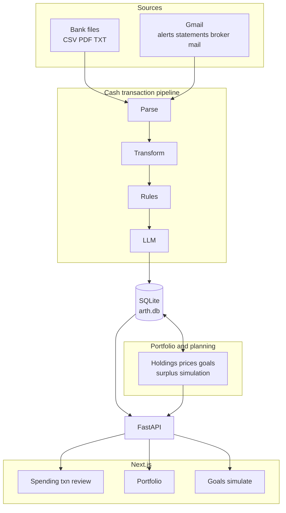

# Arth

Personal finance system for Sashank and Aditi — built for India's banking ecosystem. One **SQLite** database and a **FastAPI** backend power a **Next.js** app for the full picture: **cash-ledger** ingestion and classification, **portfolio** (holdings, marks, net worth), **goals** (hierarchy and priorities), and a **simulation** layer (surplus, funding scenarios). Raw statements and Gmail feed the transaction pipeline; rules + LLM classify spend; separate services handle prices, inflation series, and goal math — all in one place.

**Not a startup. Not a SaaS product. A tool built by two people, for two people.**

---

## What It Does Today

| Capability | Details |
|---|---|
| **Portfolio** | Holdings across sleeves (equity, MF, PPF, NPS, …), **net worth** and history, **price** / NAV marks (NSE bhav, AMFI, fallbacks), liabilities — surfaced on `/portfolio` |
| **Simulation** | Surplus, liquidity, inflation-aware **goal funding** and “what-if” runs — `/simulate` and `/goals` tied to `/api/simulate`, surplus, and liquidity APIs |
| **Goals** | Goal graph (links, hierarchy), priorities, life events, reminders — not just expense targets |
| **Cash ledger & analytics** | Full **transaction** table, metrics, trends, recurring detection, review queue — the classic “where did the money go” view |
| **Transaction ingestion** | Parse statements from four bank **sources** (HDFC savings, HDFC CC ×2, ICICI savings) |
| **Auto-classification** | Rules + LLM assign type, channel, counterparty, and category on the cash pipeline |
| **Real-time email scraping** | Gmail API polls on a schedule — bank **alerts** plus other routed mail (see scraper README) |
| **Statement reconciliation** | Email-sourced and statement-sourced **cash** rows merged; no duplicate rows, no lost review work |
| **Dashboard shell** | Session login, then home, transactions, review, portfolio, goals, simulate, settings (reminders + uploads) |

---

## Quick Start

```bash
# 1. Install dependencies
python3 -m pip install -r requirements.txt

# 2. Configure API keys and settings
cp .env.example .env
# Edit .env: AUTH_* for dashboard login; LLM keys — use *_FOR_CLASSIFIER (pipeline) and
# *_FOR_SINGLE_AGENT (CLI agent) so provider usage is split; see .env.example

# 3. Load your bank statements into the database
python3 -m pipeline.run --all-sources

# 4. Start the API server
python3 -m uvicorn api.main:app --port 8000 --reload
# Swagger UI → http://localhost:8000/docs

# 5. Start the dashboard
cd dashboard && npm install && npm run dev
# Dashboard → http://localhost:3000
```

For Gmail email scraper setup, see [`scraper/README.md`](scraper/README.md).

---

## System Architecture

High level: **one database**, **one API**, **one web app**. The diagram separates the **cash classification pipeline** (bank-specific parsers, then shared rules + LLM) from **portfolio and planning** (holdings, prices, goals, simulation) — both read and write the same SQLite file. Schedulers inside the API process handle Gmail polling, price refresh, and inflation sync.



**Not shown:** APScheduler jobs (Gmail, daily prices, weekly inflation) run inside the API process and touch the same DB — see [`api/main.py`](api/main.py) and [`scraper/scheduler.py`](scraper/scheduler.py).

---

## Dashboard

Next.js app with cookie-based login (`/login` → FastAPI sets `arth_session`). Main areas:

| Screen | What it shows |
|---|---|
| **Dashboard** (`/`) | This-month snapshot, trend charts, category grids, bar drill-down, goals/reminders, upload entry points |
| **Transactions** (`/transactions`) | Searchable, filterable, sortable table with server-side pagination; slide-in edit (counterparty, category, txn type, spend tags, exclude-from-analytics) |
| **Review Queue** (`/review`) | Card-based view of unreviewed transactions (mainly email-sourced); approve, edit-and-approve, or skip |
| **Goals** (`/goals`) | Goals CRUD, hierarchy, priorities, and links to metrics / simulation |
| **Portfolio** (`/portfolio`) | Holdings, net worth, allocations, price-backed marks, investment activity |
| **Simulate** (`/simulate`) | Goal funding and surplus “what-if” scenarios (ties to `/api/simulate`) |
| **Settings** (`/settings`) | Payment reminders and statement upload |

See [`dashboard/README.md`](dashboard/README.md) for setup and implementation details.

---

## How the Pipeline Works

Five stages, all bank-agnostic after Stage 1:

```
[1] Parse          → source-specific parser extracts raw rows
[2] Transform      → normalize to canonical schema (IDs, ISO dates, direction, amount)
[3] Rules Classify → deterministic rules fill channel, txn_type, upi_type (~96–100% accuracy)
[4] LLM Classify   → fills counterparty, category, and remaining ambiguous fields
[5] Write SQLite   → content-hash dedup; backfills NULLs without overwriting manual edits
```

**Adding a new bank source = write one parser file.** Everything downstream is bank-agnostic.

Classification accuracy on the full dataset (March 2026):

| Field | Accuracy |
|---|---|
| direction / amount / channel | 100% |
| txn_type | 98.7% |
| upi_type | 98.1% |
| counterparty | 94.9% |
| counterparty_category | 93.7% |

See [`pipeline/README.md`](pipeline/README.md) for architecture details, CLI reference, and how to add new bank sources.

---

## Real-Time Email Scraper

The server polls Gmail for bank alert emails every 15 minutes, covering ~70–80% of day-to-day spending in real time. When a monthly statement is uploaded, email-sourced transactions are automatically reconciled — no duplicates, no lost review work.

| Bank / Account | What email captures | What needs a statement |
|---|---|---|
| HDFC CC (1905/5778) | All CC swipes (real-time) | Refunds, cashback, auto-pay |
| HDFC Savings 3703 | UPI outbound + inbound | Net banking transfers, salary |
| ICICI Savings 6118 | IMPS + NEFT via iMobile | All inbound, ICICI Direct trades |

See [`scraper/README.md`](scraper/README.md) for setup (GCP project, OAuth consent, first-run flow).

---

## API Reference

The FastAPI backend groups routes like this (all except `/api/auth/*` login/logout and `/health` require a valid session cookie after login):

| Group | Prefix | What it does |
|---|---|---|
| Auth | `/api/auth` | Login, logout, session status |
| Transactions | `/api/transactions` | List, filter, CRUD, bulk update |
| Metrics | `/api/metrics` | Summary, categories, trends, accounts, dashboard chart series |
| Pipeline | `/api/pipeline` | Trigger runs, upload statements, run history |
| Scraper | `/api/scraper` | Scheduler control, OAuth, coverage map |
| Recurring | `/api/recurring` | Detect and manage recurring patterns |
| Surplus / liquidity / inflation | `/api/surplus`, `/api/liquidity`, `/api/inflation` | Household surplus, holding liquidity, IMF CPI history |
| Simulation | `/api/simulate` | Goal funding and scenario runs |
| Goals | `/api/goals`, `/api/goal-links`, `/api/life-events` | Goals CRUD, tree/hierarchy, links, life events |
| Goal suggestions | `/api/goal-suggestions` | Helper hints for goal setup |
| Holdings & investments | `/api/holdings`, `/api/investment-transactions` | Portfolio positions, imports, investment ledger |
| Liabilities & prices | `/api/liabilities`, `/api/prices` | Loans; daily prices / NAV history |
| Settings | `/api/settings` | Reminders (including derive-anchors) |

Full interactive docs at **http://localhost:8000/docs** (Swagger UI).

See [`api/README.md`](api/README.md) for the complete endpoint reference and database schema.

---

## Project Structure

```
Arth/
  pipeline/                  Classification pipeline (Parse → Transform → Rules → LLM → Write)
    parsers/                   Bank-specific statement parsers (HDFC savings/CC, ICICI)
    holding_parsers/           ICICI Direct, NPS, etc. — enrichment for holdings ingest
    holding_pipeline.py        Orchestrates holding ingest / enrichment (see pipeline README)
    config.py                  All knobs in one place (models, paths, source configs, LLM chain)
    models.py                  Pydantic models and classification enums
    rules_classifier.py        Deterministic classification rules
    llm_classifier.py          LLM abstraction (multi-model fallback, caching, tokens)
    db_writer.py               SQLite writer: content-hash dedup + email reconciliation
    run.py                     CLI entry point

  api/                       FastAPI backend
    main.py                    App entry point, CORS, lifespan, scheduler, background price + inflation jobs
    database.py                Engine, session factory, init_db()
    models.py                  SQLModel tables (transactions, holdings, goals, prices, …)
    routes/                    transactions, metrics, pipeline, scraper, recurring, surplus, liquidity,
                               inflation, simulate, goals, goal_tree, goal_links, life_events,
                               settings, holdings, investment_transactions, liabilities, prices, …

  scraper/                   Gmail email scraper
    email_parsers/             Alert parsers + statement PDF / ICICI Direct trade parsers
    orchestrator.py            Main scrape cycle (fetch → dedup → parse → classify → write)
    scheduler.py               APScheduler: Gmail poll, price job, inflation job
    gmail_client.py            OAuth2 auth + email fetching

  dashboard/                 Next.js frontend
    src/app/                   Pages: /, /login, /transactions, /review, /portfolio, /goals, /simulate, /settings
    src/components/            Dashboard, portfolio, simulation, layout, transactions, review, goals
    src/hooks/                 React Query hooks (transactions, metrics, goals, holdings, …)
    src/lib/                   Types, API client, utilities

  prompts/                   YAML prompt templates (git-versioned, safe to commit)
  scripts/                   Operator scripts (backfills, validation, migrations) — see scripts/README.md
  tests/                     pytest suite (600+ tests) — pipeline, API, scraper, portfolio, goals
  docs/                      Architecture docs, evaluations, Phase 5 guideline, data notes
  data/                      SQLite database, LLM cache (all gitignored)
```

---

## Development

**Run tests:**
```bash
pytest tests/
```

CI (GitHub Actions) runs `ruff`, `mypy`, and `pytest` with coverage on `pipeline/` and `api/` and fails if combined coverage drops below **35%** (see `.github/workflows/ci.yml`). Extra suites cover `scraper/` and other packages outside that gate.

**Optional — match CI lint locally before you push:**
```bash
python3 -m pip install pre-commit
pre-commit install
```
Hooks run `ruff check` on `pipeline/`, `api/`, `scraper/`, and `tests/` (same paths as CI).

**Environments:**

| Environment | DB file | Start command |
|---|---|---|
| prod | `data/arth.db` | `python3 -m uvicorn api.main:app --port 8000` |
| test | `data/arth_test.db` | `APP_ENV=test python3 -m uvicorn api.main:app --port 8001` |
| pytest | in-memory SQLite | `pytest tests/` |

**Local file permissions (Phase A.5):** After `init_db()` creates or touches the SQLite file, Arth sets **`chmod 600`** on `data/arth.db` (and `data/gmail_token.json` when present) so only your OS user can read/write them. This is a best-effort call on Unix-like systems; use full-disk encryption for stronger at-rest protection. See [`docs/evaluations/sqlcipher-evaluation.md`](docs/evaluations/sqlcipher-evaluation.md) for full-database encryption (SQLCipher) — **deferred** for this project’s threat model.

**Add a new bank parser:** See [`pipeline/README.md`](pipeline/README.md) for a step-by-step guide.

**Modify LLM prompts:** Edit the YAML files in `prompts/`. Read [`prompts/README.md`](prompts/README.md) first.

**Roadmap / Phase 5:** Product direction and agentic Q&A scope live in [`docs/product/arth_phase5_guideline_v3_final.md`](docs/product/arth_phase5_guideline_v3_final.md) and the [`docs/README.md`](docs/README.md) index.
