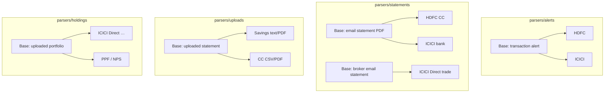

# Parser taxonomy — how Arth models imports

This document is the **single source of truth** for how we describe banks, accounts, and how data enters Arth. When writing UI or user-facing docs, describe **importing** data — not “parsing” or internal pipeline jargon (see Arth copy guidelines for tone).

---

## The four levels

Every piece of financial data sits at the intersection of four dimensions:

| Level | Question | Examples |
| ----- | -------- | -------- |
| **1. Instrument type** | What kind of account is it? | Bank account, credit card, broker (Demat), PPF, NPS |
| **2. Provider** | Who runs it? | HDFC Bank, ICICI Bank, ICICI Direct |
| **3. Account / product** | Which specific card or account? | Diners Black ending 1905, savings ending 3703 — encoded in `source_key` |
| **4. Import source** | How did the row get into Arth? | Transaction alert email, statement email (PDF), uploaded file |

**Import source** (level 4), together with 1–3, decides **which reader** runs: code under `parsers/alerts/`, `parsers/statements/`, `parsers/uploads/`, or `parsers/holdings/`.

---

## Import sources (level 4)

| Import source | What it is | Package | Typical shape |
| ------------- | ---------- | ------- | ------------- |
| **Transaction alert** | One email per spend or transfer; HTML body | `parsers/alerts/` | Real-time, single transaction |
| **Email statement** | Email with a PDF (monthly / quarterly statement) | `parsers/statements/` | Many transactions from one PDF |
| **Uploaded statement** | File the user downloaded from the bank site and dropped into Arth | `parsers/uploads/` | Same as email PDF / CSV readers, different entry point |
| **Uploaded portfolio** | Broker / PPF / NPS exports (holdings + sometimes trades) | `parsers/holdings/` | Holdings-focused readers |

**User-facing language:** say **transaction alerts**, **statement emails**, **uploaded statements**, **uploaded portfolio files** — not “email parsers” or “PDF parsers” as abstract nouns. Prefer verbs: “reading alerts”, “importing statements”.

---

## Support matrix (high level)

| Provider | Transaction alerts | Statement emails | Upload from website |
| -------- | ------------------- | ------------------ | ------------------- |
| HDFC Bank (savings) | UPI / NEFT / IMPS alerts | Smart / combined statement PDF | `.txt` export, PDF statement |
| ICICI Bank (savings) | Net banking alerts | Monthly / annual e-statement PDF | PDF statement |
| HDFC Credit Card (per card) | Card swipe alerts | Monthly CC statement PDF | CSV / PDF (varies by card) |
| ICICI Direct (equity) | — | Trade confirmations, equity statement PDF | CSV portfolio export |
| ICICI Direct (MF) | — | MF account statement PDF | CSV holdings export |
| Zerodha (equity + MF demat) | — | Monthly demat transaction statement PDF (PAN); SOA ledger classifies `INE*`/`INF*` via NSE bhav + cached AMFI NAVAll ISIN map | Console tradebook CSV (equity backup) |
| ICICI PPF | — | PPF band in ICICI bank e-statement | CSV passbook |
| NPS | — | — | Statement of holding PDF |

Email and upload are **both** first-class; users may rely on either or both. Overlapping data is **deduplicated** in the pipeline, not treated as “mail wins, file loses” by default.

---

## `source_key` convention

We tie rows to a logical source like this:

- Pattern: `{provider}_{instrument}_{last4}` (example: `hdfc_cc_1905`)
- Used for routing, labels, and deduplication — **internal**. In the UI, show human labels (bank name + masked digits), never raw keys unless debugging.

---

## Code layout (after the `parsers/` package)

| Area | Role |
| ---- | ---- |
| `parsers/alerts/` | Transaction alert readers (HTML) |
| `parsers/statements/` | Statement PDFs attached to email |
| `parsers/uploads/` | Same formats as above, entry = user file + `PARSER_REGISTRY` |
| `parsers/holdings/` | Portfolio / PPF / NPS file readers + `HOLDING_PARSER_REGISTRY` |
| `parsers/email_registry.py` | Builds the Gmail router registry (alerts + statements) |
| `scraper/` | Gmail OAuth, fetch, router, scheduler — **not** format readers |
| `pipeline/` | Sorting rules, smart labels, DB write, detection helpers |

---

## Base classes (inheritance sketch)

Exact class names live in the codebase; this diagram is only to show **layers**: alert vs statement vs upload vs holdings.

---

## Old terms → current terms (for git history readers)

| Older / internal | Prefer |
| ---------------- | ------ |
| InstaAlert | Transaction alert |
| email_parsers / pipeline/parsers (locations) | `parsers/alerts`, `parsers/statements`, `parsers/uploads`, `parsers/holdings` |
| “Parser” in UI | Import / importing / reader (context-dependent) |
| Statement-first vs mail-first | Describe both import paths equally; dedupe is implementation detail |

---

## Related docs

- [INGESTION_PATHS.md](./INGESTION_PATHS.md) — practical “how money gets in” overview  
- [parsers/README.md](../../parsers/README.md) — contributor recipe for adding a bank  
